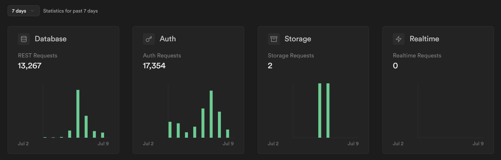
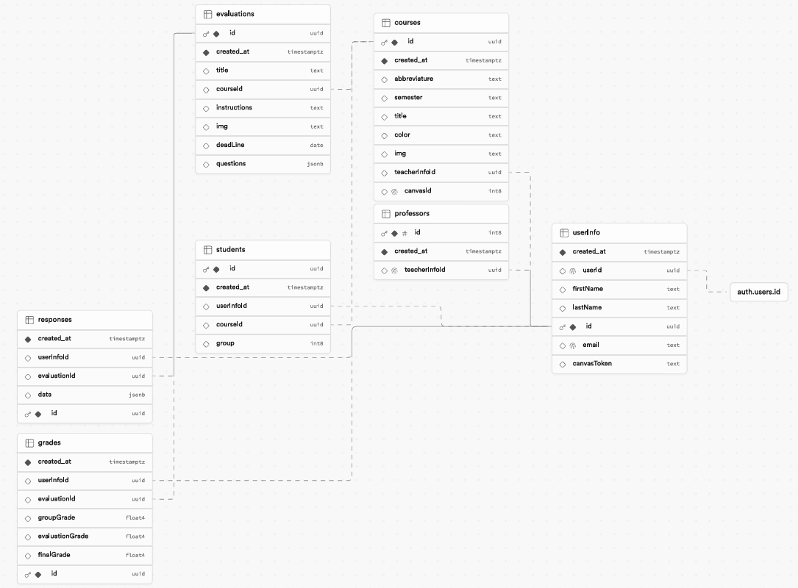

# IDSApp

## Introducción

IDSApp es una aplicación web para gestionar los cursos del Instituto para el Desarrollo Sustentable, principalmente sus coevaluaciones y autoevaluaciones.

**Sitio web:** [idsapp.vercel.app](https://idsapp.vercel.app)

### Tecnologías (Stack)
- **JavaScript Runtime**: Bun
- **Framework**: Next.js
- **Gestión de estado en cliente**: SWR
- **Estilos**: Tailwind CSS
- **Base de datos y autenticación**: Supabase
- **Mailer**: Resend
- **Linter**: ESLint

#### APIs externas
- Canvas LMS

#### Librerías de componentes
- shadcn/ui
- lucide-react

### Variables de entorno
Crear un archivo `.env.local` y rellenar las variables de entorno que se encuentran en el archivo `.env.local.example`.

### Linter
Para correr el linter, ejecutar el siguiente comando:
```bash
bun lint
```

## Diseño

### Usuarios / clientes

Los usuarios de la aplicación son los alumnos, ayudantes y docentes del Instituto para el Desarrollo Sustentable.

### Usuarios simultáneos

La aplicación soporta múltiples usuarios simultáneos:
- 2024-1: **372 usuarios simultáneos**

### Uso de la base de datos y autenticación

La semana de Coevaluaciones 2024-1 (solo alumnos SUS1000) se mostró un uso de la base de datos y autenticación con picos de **7035 solicitudes a la base de datos** y **5196 solicitudes de autenticación**.



### Historia de IDSApp

IDSApp fue creada para facilitar la coevaluación y autoevaluación de los alumnos del Instituto para el Desarrollo Sustentable.

Hasta 2023-2 se utilizaba una planilla de Google Sheets con scripts de Google Apps Script para gestionar las coevaluaciones. Este generaba un Google Form para que los alumnos ingresaran sus coevaluaciones.

#### Problemas de la planilla de Google Sheets

- **Código no mantenible**: El código de Google Apps Script era difícil de mantener y no se podía versionar. Era frágil y con alto acoplamiento.

- **Solo se podía acceder con cuenta Gmail UC, o dejar público para todos**: La planilla de Google Sheets solo podía ser accedida por cuentas Gmail UC, lo que dificultaba la colaboración con personas externas a la UC. La única alternativa era hacer la planilla pública, lo que no era seguro.

- **Si alguien respondía dos veces, afectaba la nota a todo su grupo**: Si un alumno respondía dos veces, afectaba la nota de todo su grupo. Esto era un problema común. La planilla no tenía mecanismos para evitar esto, por lo que se debía revisar manualmente e insistir a los alumnos que no respondieran dos veces.

- **Para crear una nueva coevaluación, se debía copiar la planilla original y modificarla**: Para cada coevaluación, se debía copiar la planilla original y modificarla. Esto era tedioso y propenso a errores. Además, no preservaba mejoras al código hechas en coevaluaciones anteriores.

- **Transición de la UC hacia Microsoft 365**: La UC está migrando sus servicios hacia Microsoft 365, lo que implica que Google Sheets no es una herramienta oficial de la UC.

Esta planilla ha sido utilizada por múltiples cursos del Instituto para el Desarrollo Sustentable, y ha generado una gran cantidad de datos que no se pueden migrar fácilmente a una nueva plataforma.

#### Pensando en una nueva solución

En 2023-2, se decidió crear una nueva aplicación web para gestionar las coevaluaciones y autoevaluaciones. Esta aplicación se llamó **SusApp**.

- Enero 2024-1: Se creó un prototipo de SusApp, SusApp Mockup. [Ir al sitio web](https://susapp-mockup.vercel.app/)
- Febrero y Marzo 2024: Se creó la primera versión de SusApp, la cual cambió de nombre a **IDSApp** y posteriormente a **IDSApp Legacy**. Estaba hecha con Vite, React y Tailwind CSS. [Ir al sitio web](https://idsapp-legacy.vercel.app/)
- Abril 2024 hasta la fecha: Se creó la segunda versión de IDSApp, la cual se encuentra en producción. [Ir al sitio web](https://idsapp.vercel.app)


## Documentación

### Base de datos (supabase)

#### Diagrama de la base de datos



<br />
<hr />

> A continuación está la documentación entregada por la plantilla de Next.js y Supabase.

<a href="https://demo-nextjs-with-supabase.vercel.app/">
  
  <h2 align="center">Next.js and Supabase Starter Kit</h2>
</a>

<p align="center">
 The fastest way to build apps with Next.js and Supabase
</p>

<p align="center">
  <a href="#features"><strong>Features</strong></a> ·
  <a href="#demo"><strong>Demo</strong></a> ·
  <a href="#deploy-to-vercel"><strong>Deploy to Vercel</strong></a> ·
  <a href="#clone-and-run-locally"><strong>Clone and run locally</strong></a> ·
  <a href="#feedback-and-issues"><strong>Feedback and issues</strong></a>
  <a href="#more-supabase-examples"><strong>More Examples</strong></a>
</p>
<br/>

## Features

- Works across the entire [Next.js](https://nextjs.org) stack
  - App Router
  - Pages Router
  - Middleware
  - Client
  - Server
  - It just works!
- supabase-ssr. A package to configure Supabase Auth to use cookies
- Styling with [Tailwind CSS](https://tailwindcss.com)
- Optional deployment with [Supabase Vercel Integration and Vercel deploy](#deploy-your-own)
  - Environment variables automatically assigned to Vercel project

## Demo

You can view a fully working demo at [demo-nextjs-with-supabase.vercel.app](https://demo-nextjs-with-supabase.vercel.app/).

## Deploy to Vercel

Vercel deployment will guide you through creating a Supabase account and project.

After installation of the Supabase integration, all relevant environment variables will be assigned to the project so the deployment is fully functioning.

[](https://vercel.com/new/clone?repository-url=https%3A%2F%2Fgithub.com%2Fvercel%2Fnext.js%2Ftree%2Fcanary%2Fexamples%2Fwith-supabase&project-name=nextjs-with-supabase&repository-name=nextjs-with-supabase&demo-title=nextjs-with-supabase&demo-description=This%20starter%20configures%20Supabase%20Auth%20to%20use%20cookies%2C%20making%20the%20user's%20session%20available%20throughout%20the%20entire%20Next.js%20app%20-%20Client%20Components%2C%20Server%20Components%2C%20Route%20Handlers%2C%20Server%20Actions%20and%20Middleware.&demo-url=https%3A%2F%2Fdemo-nextjs-with-supabase.vercel.app%2F&external-id=https%3A%2F%2Fgithub.com%2Fvercel%2Fnext.js%2Ftree%2Fcanary%2Fexamples%2Fwith-supabase&demo-image=https%3A%2F%2Fdemo-nextjs-with-supabase.vercel.app%2Fopengraph-image.png&integration-ids=oac_VqOgBHqhEoFTPzGkPd7L0iH6)

The above will also clone the Starter kit to your GitHub, you can clone that locally and develop locally.

If you wish to just develop locally and not deploy to Vercel, [follow the steps below](#clone-and-run-locally).

## Clone and run locally

1. You'll first need a Supabase project which can be made [via the Supabase dashboard](https://database.new)

2. Create a Next.js app using the Supabase Starter template npx command

   ```bash
   npx create-next-app -e with-supabase
   ```

3. Use `cd` to change into the app's directory

   ```bash
   cd name-of-new-app
   ```

4. Rename `.env.local.example` to `.env.local` and update the following:

   ```
   NEXT_PUBLIC_SUPABASE_URL=[INSERT SUPABASE PROJECT URL]
   NEXT_PUBLIC_SUPABASE_ANON_KEY=[INSERT SUPABASE PROJECT API ANON KEY]
   ```

   Both `NEXT_PUBLIC_SUPABASE_URL` and `NEXT_PUBLIC_SUPABASE_ANON_KEY` can be found in [your Supabase project's API settings](https://app.supabase.com/project/_/settings/api)

5. You can now run the Next.js local development server:

   ```bash
   npm run dev
   ```

   The starter kit should now be running on [localhost:3000](http://localhost:3000/).

> Check out [the docs for Local Development](https://supabase.com/docs/guides/getting-started/local-development) to also run Supabase locally.

## Feedback and issues

Please file feedback and issues over on the [Supabase GitHub org](https://github.com/supabase/supabase/issues/new/choose).

## More Supabase examples

- [Next.js Subscription Payments Starter](https://github.com/vercel/nextjs-subscription-payments)
- [Cookie-based Auth and the Next.js 13 App Router (free course)](https://youtube.com/playlist?list=PL5S4mPUpp4OtMhpnp93EFSo42iQ40XjbF)
- [Supabase Auth and the Next.js App Router](https://github.com/supabase/supabase/tree/master/examples/auth/nextjs)
