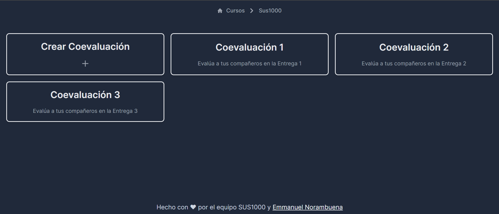
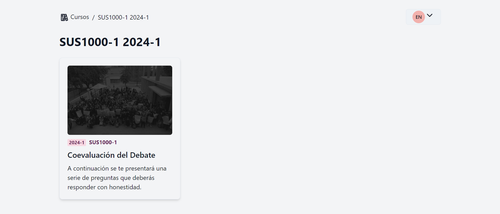
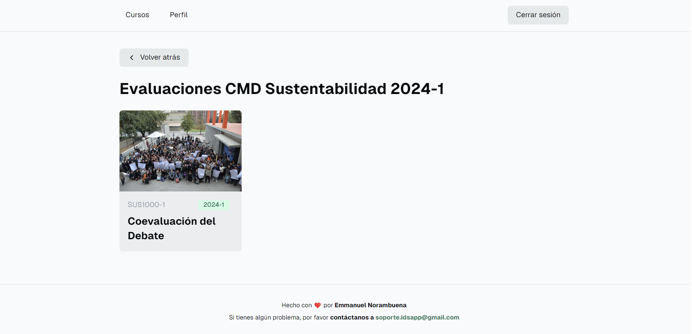

# Loopaas (antes IDSApp)

[](https://deepwiki.com/eanorambuena/idsapp-v2)

## Introducción

Loopaas es una aplicación web para gestionar cursos, credenciales y evaluaciones para equipos y organizaciones.

**Sitio web:** [idsapp.vercel.app](https://idsapp.vercel.app)

## 📜 Índice
- [📦 Instalación](#instalación)
- [⚙️ Configuración](#configuración)
- [🚀 Uso](#uso)
- [💡 Diseño](#diseño)
- [🚀 Resultados](#resultados)
- [📝 Licencia](#licencia)

## Instalación

Clonar el repositorio. Por ejemplo, con SSH:
```bash
git clone git@github.com:eanorambuena/idsapp-v2.git
```

Si no tienes Bun, puedes instalarlo con npm:
```bash
npm install -g bun
```

Instalar las dependencias:
```bash
bun install
```

Correr el servidor de desarrollo:
```bash
bun dev
```

### Tecnologías (Stack)
- **JavaScript Runtime**: Bun
- **Framework**: Next.js
- **Gestión de estado en cliente**: SWR
- **Estilos**: Tailwind CSS
- **Base de datos y autenticación**: Supabase
- **Mailer**: Resend
- **Linter**: ESLint

#### APIs externas
- Canvas LMS

#### Librerías de componentes
- shadcn/ui
- lucide-react

### Variables de entorno
Crear un archivo `.env.local` y rellenar las variables de entorno que se encuentran en el archivo `.env.local.example`.

### Linter
Para correr el linter, ejecutar el siguiente comando:
```bash
bun lint
```

## Configuración

### Base de datos (supabase)

#### Diagrama de la base de datos


Representado como SQL, el diagrama de la base de datos es el siguiente:

```sql
-- WARNING: This schema is for context only and is not meant to be run.
-- Table order and constraints may not be valid for execution.

CREATE TABLE public.courses (
  id uuid NOT NULL DEFAULT gen_random_uuid(),
  created_at timestamp with time zone NOT NULL DEFAULT now(),
  abbreviature text,
  semester text,
  title text,
  color text,
  img text,
  teacherInfoId uuid,
  canvasId bigint,
  CONSTRAINT courses_pkey PRIMARY KEY (id),
  CONSTRAINT courses_teacherInfoId_fkey FOREIGN KEY (teacherInfoId) REFERENCES public.userInfo(id)
);
CREATE TABLE public.evaluations (
  id uuid NOT NULL DEFAULT gen_random_uuid(),
  created_at timestamp with time zone NOT NULL DEFAULT now(),
  title text,
  courseId uuid,
  instructions text,
  img text,
  deadLine date,
  questions jsonb,
  CONSTRAINT evaluations_pkey PRIMARY KEY (id),
  CONSTRAINT evaluations_courseId_fkey FOREIGN KEY (courseId) REFERENCES public.courses(id)
);
CREATE TABLE public.grades (
  id uuid NOT NULL DEFAULT gen_random_uuid(),
  score real,
  created_at timestamp with time zone NOT NULL DEFAULT now(),
  userInfoId uuid,
  evaluationId uuid,
  CONSTRAINT grades_pkey PRIMARY KEY (id),
  CONSTRAINT grades_userInfoId_fkey FOREIGN KEY (userInfoId) REFERENCES public.userInfo(id),
  CONSTRAINT grades_evaluationId_fkey FOREIGN KEY (evaluationId) REFERENCES public.evaluations(id)
);
CREATE TABLE public.professors (
  courseId uuid,
  id uuid NOT NULL DEFAULT gen_random_uuid(),
  created_at timestamp with time zone NOT NULL DEFAULT now(),
  teacherInfoId uuid,
  CONSTRAINT professors_pkey PRIMARY KEY (id),
  CONSTRAINT professors_teacherInfoId_fkey FOREIGN KEY (teacherInfoId) REFERENCES public.userInfo(id),
  CONSTRAINT professors_courseId_fkey FOREIGN KEY (courseId) REFERENCES public.courses(id)
);
CREATE TABLE public.responses (
  data jsonb,
  id uuid NOT NULL DEFAULT gen_random_uuid(),
  created_at timestamp with time zone NOT NULL DEFAULT now(),
  userInfoId uuid,
  evaluationId uuid,
  CONSTRAINT responses_pkey PRIMARY KEY (id),
  CONSTRAINT responses_userInfoId_fkey FOREIGN KEY (userInfoId) REFERENCES public.userInfo(id),
  CONSTRAINT responses_evaluationId_fkey FOREIGN KEY (evaluationId) REFERENCES public.evaluations(id)
);
CREATE TABLE public.students (
  id uuid NOT NULL DEFAULT gen_random_uuid(),
  created_at timestamp with time zone NOT NULL DEFAULT now(),
  userInfoId uuid,
  courseId uuid,
  group bigint,
  CONSTRAINT students_pkey PRIMARY KEY (id),
  CONSTRAINT students_courseId_fkey FOREIGN KEY (courseId) REFERENCES public.courses(id),
  CONSTRAINT students_userInfoId_fkey FOREIGN KEY (userInfoId) REFERENCES public.userInfo(id)
);
CREATE TABLE public.userInfo (
  created_at timestamp with time zone NOT NULL DEFAULT now(),
  firstName text,
  id uuid NOT NULL DEFAULT gen_random_uuid(),
  lastName text,
  userId uuid,
  email text,
  canvasToken text,
  CONSTRAINT userInfo_pkey PRIMARY KEY (id),
  CONSTRAINT userInfo_userId_fkey FOREIGN KEY (userId) REFERENCES auth.users(id)
);
```

Anteriormente se calculaba la nota final en la plataforma, pero por motivos de simplicidad, se dejó de calcular. Esto se puede ver en el diagrama de la base de datos antiguo.


#### Setup

##### 1) Crear tablas basadas en el Diagrama de la base de datos

Es importante recordar:
- Activar (si no lo está) **Row Level Security (RLS)** para todas las tablas
- Usar `uuid` para todas las ids
- Configurar correctamente las claves foráneas

##### 2) Agregar Policies para cada tabla

En `Authentication > Policies` se debe agregar las policies necesarias para cada tabla.

Todas las tablas deben tener la siguiente policy: **`Enable select for authenticated users only`**

##### 3) Agregar la *URL* del sitio web a la URL Configuration de Supabase

En `Authentication > URL Configuration > Site URL` se debe agregar la URL del sitio web, sin `/` al final.

##### 4) Agregar Primer usuario y Primer curso

El primer usuario debe ser asignado **Profesor** para que pueda administrar el curso.
También debe ser asignado **Estudiante**, a un grupo no usado por los estudiantes del curso.

#### Evaluaciones

Dada la naturaleza flexible de las evaluaciones, sus preguntas se guardan en formato JSON binario en la base de datos. Esto permite agregar nuevas evaluaciones sin necesidad de modificar la base de datos.

Un ejemplo de JSON válido es:
```json
{
  "1":
    {"type": "linear",
    "criteria": [
      {
        "label": "Respeto y buen ambiente",
        "weight": 1  
      },
      {
        "label": "Contribución al trabajo",
        "weight": 1
      },
      {
        "label": "Comunicación y compromiso",
        "weight": 1
      }
    ],
    "required": true
  }
}
```

#### Integración con Resend

Para enviar correos electrónicos, se utiliza Resend. Resend es un servicio de envío de correos electrónicos transaccionales que permite enviar correos electrónicos de forma segura y confiable. Desde Septiembre 2024, Supabase requiere que los correos electrónicos sean enviados a través de un servicio de envío de correos electrónicos SMTP de terceros, como Resend.

Resend requiere un dominio verificado para enviar correos electrónicos que no sea un dominio gratuito público. Por lo tanto, 'idsapp.vercel.app' no es un dominio válido para enviar correos electrónicos. Para enviar correos electrónicos, se debe configurar un dominio personalizado y verificarlo en Resend.

Esto es requerido para el SignUp de Supabase, incluso si no se envían correos electrónicos de verificación. Por este motivo, actualmente no se puede utilizar el SignUp de Supabase en IDSApp y el botón de SignUp está comentado en el código a la fecha (17 de Noviembre 2024).

### Vercel

Después de configurar Supabase, se deben agregar las variables de entorno a Vercel. Para esto, se deben agregar las siguientes variables de entorno en la configuración del proyecto en Vercel:
- `NEXT_PUBLIC_SUPABASE_URL`: URL de Supabase
- `NEXT_PUBLIC_SUPABASE_ANON_KEY`: Clave Anónima de Supabase
- `NEXT_PRIVATE_SUPABASE_SERVICE_ROLE_KEY`: Clave de Servicio de Supabase
- `NEXT_RESEND_API_TOKEN`: Clave de API de Resend
- `NEXT_CANVAS_API_TOKEN`: Clave de API de Canvas

### Auth0

Para la autenticación de usuarios, además de Supabase, se utiliza Auth0. Esto permite que los usuarios puedan iniciar sesión con su cuenta de Google UC o con su cuenta de Microsoft UC.

Pasos:
1. Crear una cuenta en Auth0.
2. Crear una nueva aplicación en Auth0.

Selecciona Regular Web Application.

Configura los Callback URLs y Logout URLs:

Callback URL: http://localhost:3000/api/auth/callback

Logout URL: http://localhost:3000

3. Añadir una integración con Auth0 en Supabase usando el dominio de Auth0.
4. Seguir la guía [de integración de Auth0 con Supabase](https://supabase.com/docs/guides/auth/third-party/auth0).

Se debe crear una *Custom Action* en Auth0 para agregar el rol de usuario autentificado al token de acceso. Esto se hace para que Supabase pueda identificar el rol del usuario y mostrar la información correspondiente.

La *Custom Action* debe ser de tipo `Post Login` y debe tener el siguiente código:

```javascript
exports.onExecutePostLogin = async (event, api) => {
    api.accessToken.setCustomClaim('role', 'authenticated');
};
```

5. Instalar el SDK de Auth0 para Next.js
Ejecuta el siguiente comando:
```bash
bun add @auth0/nextjs-auth0 @supabase/auth-helpers-nextjs @supabase/supabase-js
```

6. Configurar variables de entorno
En el archivo `.env.local`, agregar las siguientes variables de entorno:

```bash
NEXT_AUTH0_SECRET=<una cadena segura generada con openssl rand -hex 32>
NEXT_AUTH0_BASE_URL=http://localhost:3000
NEXT_AUTH0_ISSUER_BASE_URL=https://<tu-dominio-auth0>.auth0.com
NEXT_AUTH0_CLIENT_ID=<tu-client-id>
NEXT_AUTH0_CLIENT_SECRET=<tu-client-secret>
```

### Caniuse-lite

```bash
Browserslist: caniuse-lite is outdated. Please run:
  npx update-browserslist-db@latest
  Why you should do it regularly: https://github.com/browserslist/update-db#readme
```

### Otros Iconos

[Google](https://www.svgrepo.com/svg/303108/google-icon-logo)
[Microsoft](https://www.svgrepo.com/svg/448239/microsoft)

## Uso

Se puede acceder a la aplicación web en [idsapp.vercel.app](https://idsapp.vercel.app)

### Instrucciones de uso
Para cada tipo de usuario, se debe indicar cómo usar la aplicación. Por ejemplo, para los estudiantes, se debe indicar cómo acceder a las coevaluaciones. Por ejemplo, desde el primer semestre 2024, se les otorga a los estudiantes las siguientes instrucciones:
[Ejemplo de Instrucciones de uso de IDSApp](./docs/usage_instructions_example.pdf)

## Diseño

### Usuarios / clientes

Los usuarios de la aplicación pueden ser alumnos, ayudantes, docentes y miembros de cualquier organización o equipo.

### Colores

Se utilizan los colores de Tailwind CSS, cuidando la accesibilidad e identidad visual de IDSApp.

- **Verde Acento**: `emerald-700`
- **Gris Fondo y Texto**: `gray`
- **Verde Éxito**: `green-500`
- **Rojo Error**: `red-500`
- **Amarillo Advertencia**: `yellow-500`
- **Azul Información**: `blue-500`

Se debe evitar el uso de negro y blanco puros, y se debe priorizar el uso de los colores de la paleta de Tailwind CSS.

### Espacios

Se usa *padding 4* para elementos cohesionados, *padding 6* para distinguir elementos.

Se evita el uso de margin, para separar elementos en un contenedor se usa *gap 6*

### Bordes

Se usa borde redondo `rounded-md`

### Formularios y enlaces

Se usa color sólido para *Call To Action*, usando `<MainButton>`. Para botones o enlaces secundarios se usa `<SecondaryButton>` o `<SecondaryLink>`. Para botones "hoverables" se usa `<HovereableLink>`.

### Íconos

Los íconos son extraídos principalmente de [Tabler Icons](https://tabler.io/icons). Es importante cuidar la coherencia del estilo visual de los íconos.

## Historia de Loopaas

Loopaas (antes IDSApp) fue creada para facilitar la coevaluación y autoevaluación de alumnos y equipos en cualquier organización.

Hasta 2023-2 se utilizaba una planilla de Google Sheets con scripts de Google Apps Script para gestionar las coevaluaciones. Este generaba un Google Form para que los alumnos ingresaran sus coevaluaciones.

### Problemas de la planilla de Google Sheets

- **Código no mantenible**: El código de Google Apps Script era difícil de mantener y no se podía versionar. Era frágil y con alto acoplamiento.

- **Solo se podía acceder con cuenta Gmail UC, o dejar público para todos**: La planilla de Google Sheets solo podía ser accedida por cuentas Gmail UC, lo que dificultaba la colaboración con personas externas a la UC. La única alternativa era hacer la planilla pública, lo que no era seguro.

- **Si alguien respondía dos veces, afectaba la nota a todo su grupo**: Si un alumno respondía dos veces, afectaba la nota de todo su grupo. Esto era un problema común. La planilla no tenía mecanismos para evitar esto, por lo que se debía revisar manualmente e insistir a los alumnos que no respondieran dos veces.

- **Para crear una nueva coevaluación, se debía copiar la planilla original y modificarla**: Para cada coevaluación, se debía copiar la planilla original y modificarla. Esto era tedioso y propenso a errores. Además, no preservaba mejoras al código hechas en coevaluaciones anteriores.

- **Transición de la UC hacia Microsoft 365**: La UC está migrando sus servicios hacia Microsoft 365, lo que implica que Google Sheets no es una herramienta oficial de la UC.

Esta planilla ha sido utilizada por múltiples cursos y equipos, y ha generado una gran cantidad de datos que no se pueden migrar fácilmente a una nueva plataforma.

### Pensando en una nueva solución

En 2023-2, se decidió crear una nueva aplicación web para gestionar las coevaluaciones y autoevaluaciones. Esta aplicación se llamó **SusApp**.

- Enero 2024-1: Se creó un prototipo de SusApp, SusApp Mockup. [Ir al sitio web](https://susapp-mockup.vercel.app/)

- Febrero y Marzo 2024: Se creó la primera versión de SusApp, la cual cambió de nombre a **IDSApp** y posteriormente a **IDSApp Legacy**. Estaba hecha con Vite, React y Tailwind CSS. [Ir al sitio web](https://idsapp-legacy.vercel.app/)

- Abril 2024 hasta la fecha: Se creó la segunda versión de IDSApp (ahora Loopaas), la cual se encuentra en producción. [Ir al sitio web](https://idsapp.vercel.app)


## Resultados

### Métricas

#### Usuarios simultáneos

La aplicación soporta múltiples usuarios simultáneos:
- 2024-1: **372 usuarios simultáneos**

#### Uso de la base de datos y autenticación

La semana de Coevaluaciones 2024-1 (solo alumnos SUS1000) se mostró un uso de la base de datos y autenticación con picos de **7035 solicitudes a la base de datos** y **5196 solicitudes de autenticación**.


<br />
<hr />

## Documentación original

A continuación está la documentación entregada por la plantilla de Next.js y Supabase.

<a href="https://demo-nextjs-with-supabase.vercel.app/">
  
  <h2 align="center">Next.js and Supabase Starter Kit</h2>
</a>

<p align="center">
 The fastest way to build apps with Next.js and Supabase
</p>

<p align="center">
  <a href="#features"><strong>Features</strong></a> ·
  <a href="#demo"><strong>Demo</strong></a> ·
  <a href="#deploy-to-vercel"><strong>Deploy to Vercel</strong></a> ·
  <a href="#clone-and-run-locally"><strong>Clone and run locally</strong></a> ·
  <a href="#feedback-and-issues"><strong>Feedback and issues</strong></a>
  <a href="#more-supabase-examples"><strong>More Examples</strong></a>
</p>
<br/>

## Features

- Works across the entire [Next.js](https://nextjs.org) stack
  - App Router
  - Pages Router
  - Middleware
  - Client
  - Server
  - It just works!
- supabase-ssr. A package to configure Supabase Auth to use cookies
- Styling with [Tailwind CSS](https://tailwindcss.com)
- Optional deployment with [Supabase Vercel Integration and Vercel deploy](#deploy-your-own)
  - Environment variables automatically assigned to Vercel project

## Demo

You can view a fully working demo at [demo-nextjs-with-supabase.vercel.app](https://demo-nextjs-with-supabase.vercel.app/).

## Deploy to Vercel

Vercel deployment will guide you through creating a Supabase account and project.

After installation of the Supabase integration, all relevant environment variables will be assigned to the project so the deployment is fully functioning.

[](https://vercel.com/new/clone?repository-url=https%3A%2F%2Fgithub.com%2Fvercel%2Fnext.js%2Ftree%2Fcanary%2Fexamples%2Fwith-supabase&project-name=nextjs-with-supabase&repository-name=nextjs-with-supabase&demo-title=nextjs-with-supabase&demo-description=This%20starter%20configures%20Supabase%20Auth%20to%20use%20cookies%2C%20making%20the%20user's%20session%20available%20throughout%20the%20entire%20Next.js%20app%20-%20Client%20Components%2C%20Server%20Components%2C%20Route%20Handlers%2C%20Server%20Actions%20and%20Middleware.&demo-url=https%3A%2F%2Fdemo-nextjs-with-supabase.vercel.app%2F&external-id=https%3A%2F%2Fgithub.com%2Fvercel%2Fnext.js%2Ftree%2Fcanary%2Fexamples%2Fwith-supabase&demo-image=https%3A%2F%2Fdemo-nextjs-with-supabase.vercel.app%2Fopengraph-image.png&integration-ids=oac_VqOgBHqhEoFTPzGkPd7L0iH6)

The above will also clone the Starter kit to your GitHub, you can clone that locally and develop locally.

If you wish to just develop locally and not deploy to Vercel, [follow the steps below](#clone-and-run-locally).

## Clone and run locally

1. You'll first need a Supabase project which can be made [via the Supabase dashboard](https://database.new)

2. Create a Next.js app using the Supabase Starter template npx command

   ```bash
   npx create-next-app -e with-supabase
   ```

3. Use `cd` to change into the app's directory

   ```bash
   cd name-of-new-app
   ```

4. Rename `.env.local.example` to `.env.local` and update the following:

   ```
   NEXT_PUBLIC_SUPABASE_URL=[INSERT SUPABASE PROJECT URL]
   NEXT_PUBLIC_SUPABASE_ANON_KEY=[INSERT SUPABASE PROJECT API ANON KEY]
   ```

   Both `NEXT_PUBLIC_SUPABASE_URL` and `NEXT_PUBLIC_SUPABASE_ANON_KEY` can be found in [your Supabase project's API settings](https://app.supabase.com/project/_/settings/api)

5. You can now run the Next.js local development server:

   ```bash
   npm run dev
   ```

   The starter kit should now be running on [localhost:3000](http://localhost:3000/).

> Check out [the docs for Local Development](https://supabase.com/docs/guides/getting-started/local-development) to also run Supabase locally.

## Feedback and issues

Please file feedback and issues over on the [Supabase GitHub org](https://github.com/supabase/supabase/issues/new/choose).

## More Supabase examples

- [Next.js Subscription Payments Starter](https://github.com/vercel/nextjs-subscription-payments)
- [Cookie-based Auth and the Next.js 13 App Router (free course)](https://youtube.com/playlist?list=PL5S4mPUpp4OtMhpnp93EFSo42iQ40XjbF)
- [Supabase Auth and the Next.js App Router](https://github.com/supabase/supabase/tree/master/examples/auth/nextjs)
# Hook pre-commit configurado correctamente ✅
