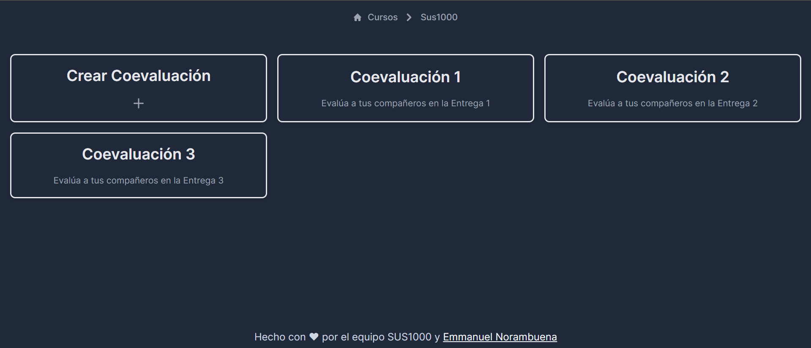
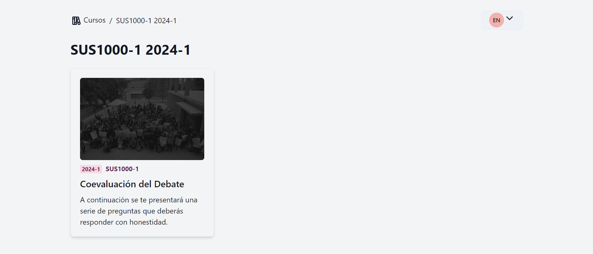
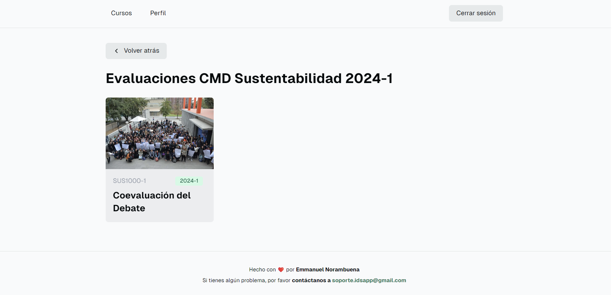
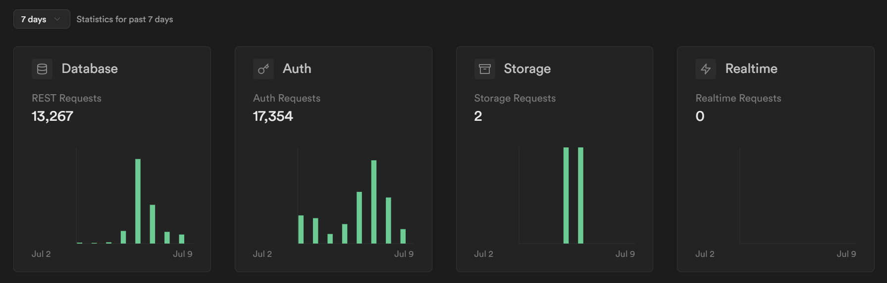

# Loopaas (antes IDSApp)

[](https://deepwiki.com/eanorambuena/idsapp-v2)

## Introducción

Loopaas es una aplicación web para gestionar cursos, credenciales y evaluaciones para equipos y organizaciones.

**Sitio web:** [idsapp.vercel.app](https://idsapp.vercel.app)

## 📜 Índice
- [📦 Instalación](#instalación)
- [⚙️ Configuración](#configuración)
- [🚀 Uso](#uso)
- [💡 Diseño](#diseño)
- [🚀 Resultados](#resultados)
- [📝 Licencia](#licencia)

## Instalación

Clonar el repositorio. Por ejemplo, con SSH:
```bash
git clone git@github.com:eanorambuena/loopaas.git
```

Si no tienes Bun, puedes instalarlo con npm:
```bash
npm install -g bun
```

Instalar las dependencias:
```bash
bun install
```

Correr el servidor de desarrollo:
```bash
bun dev
```

### Tecnologías (Stack)
- **JavaScript Runtime**: Bun
- **Framework**: Next.js
- **Gestión de estado en cliente**: SWR
- **Estilos**: Tailwind CSS
- **Base de datos**: Neon (Postgres) + Drizzle ORM
- **Autenticación**: NextAuth.js v5
- **Linter**: ESLint

#### APIs externas
- Canvas LMS

#### Librerías de componentes
- shadcn/ui
- lucide-react

### Variables de entorno
Crear un archivo `.env.local` y rellenar las variables de entorno que se encuentran en el archivo `.env.local.example`.

### Linter
Para correr el linter, ejecutar el siguiente comando:
```bash
bun lint
```

## Configuración

### Base de datos (Neon)

La base de datos usa Neon (Postgres serverless) con Drizzle ORM. El schema completo está en `drizzle/schema.ts`.

#### Setup

1. Crear proyecto en [Neon](https://neon.tech) y copiar `DATABASE_URL`
2. Agregar `DATABASE_URL` a `.env.local`
3. Ejecutar: `npx drizzle-kit push` (crea todas las tablas)

#### Evaluaciones

Dada la naturaleza flexible de las evaluaciones, sus preguntas se guardan en formato JSON en la base de datos. Esto permite agregar nuevas evaluaciones sin necesidad de modificar la base de datos.

### Vercel

Las variables de entorno necesarias para Vercel:
- `DATABASE_URL`: URL de conexion a Neon
- `AUTH_SECRET`: Secreto de NextAuth.js
- `AUTH_GOOGLE_ID` / `AUTH_GOOGLE_SECRET`: Credenciales Google OAuth (opcional)
- `AUTH_GITHUB_ID` / `AUTH_GITHUB_SECRET`: Credenciales GitHub OAuth (opcional)
- `NEXT_CANVAS_API_TOKEN`: Clave de API de Canvas

### Caniuse-lite

```bash
Browserslist: caniuse-lite is outdated. Please run:
  npx update-browserslist-db@latest
  Why you should do it regularly: https://github.com/browserslist/update-db#readme
```

### Otros Iconos

[Google](https://www.svgrepo.com/svg/303108/google-icon-logo)
[Microsoft](https://www.svgrepo.com/svg/448239/microsoft)

## Uso

Se puede acceder a la aplicación web en [idsapp.vercel.app](https://idsapp.vercel.app)

### Instrucciones de uso
Para cada tipo de usuario, se debe indicar cómo usar la aplicación. Por ejemplo, para los estudiantes, se debe indicar cómo acceder a las coevaluaciones. Por ejemplo, desde el primer semestre 2024, se les otorga a los estudiantes las siguientes instrucciones:
[Ejemplo de Instrucciones de uso de Loopaas](./docs/usage_instructions_example.pdf)

## Diseño

### Usuarios / clientes

Los usuarios de la aplicación pueden ser alumnos, ayudantes, docentes y miembros de cualquier organización o equipo.

### Colores

Se utilizan los colores de Tailwind CSS, cuidando la accesibilidad e identidad visual de Loopaas.

- **Verde Acento**: `emerald-700`
- **Gris Fondo y Texto**: `gray`
- **Verde Éxito**: `green-500`
- **Rojo Error**: `red-500`
- **Amarillo Advertencia**: `yellow-500`
- **Azul Información**: `blue-500`

Se debe evitar el uso de negro y blanco puros, y se debe priorizar el uso de los colores de la paleta de Tailwind CSS.

### Espacios

Se usa *padding 4* para elementos cohesionados, *padding 6* para distinguir elementos.

Se evita el uso de margin, para separar elementos en un contenedor se usa *gap 6*

### Bordes

Se usa borde redondo `rounded-md`

### Formularios y enlaces

Se usa color sólido para *Call To Action*, usando `<MainButton>`. Para botones o enlaces secundarios se usa `<SecondaryButton>` o `<SecondaryLink>`. Para botones "hoverables" se usa `<HovereableLink>`.

### Íconos

Los íconos son extraídos principalmente de [Tabler Icons](https://tabler.io/icons). Es importante cuidar la coherencia del estilo visual de los íconos.

## Historia de Loopaas

Loopaas (antes IDSApp) fue creada para facilitar la coevaluación y autoevaluación de alumnos y equipos en cualquier organización.

Hasta 2023-2 se utilizaba una planilla de Google Sheets con scripts de Google Apps Script para gestionar las coevaluaciones. Este generaba un Google Form para que los alumnos ingresaran sus coevaluaciones.

### Problemas de la planilla de Google Sheets

- **Código no mantenible**: El código de Google Apps Script era difícil de mantener y no se podía versionar. Era frágil y con alto acoplamiento.

- **Solo se podía acceder con cuenta Gmail UC, o dejar público para todos**: La planilla de Google Sheets solo podía ser accedida por cuentas Gmail UC, lo que dificultaba la colaboración con personas externas a la UC. La única alternativa era hacer la planilla pública, lo que no era seguro.

- **Si alguien respondía dos veces, afectaba la nota a todo su grupo**: Si un alumno respondía dos veces, afectaba la nota de todo su grupo. Esto era un problema común. La planilla no tenía mecanismos para evitar esto, por lo que se debía revisar manualmente e insistir a los alumnos que no respondieran dos veces.

- **Para crear una nueva coevaluación, se debía copiar la planilla original y modificarla**: Para cada coevaluación, se debía copiar la planilla original y modificarla. Esto era tedioso y propenso a errores. Además, no preservaba mejoras al código hechas en coevaluaciones anteriores.

- **Transición de la UC hacia Microsoft 365**: La UC está migrando sus servicios hacia Microsoft 365, lo que implica que Google Sheets no es una herramienta oficial de la UC.

Esta planilla ha sido utilizada por múltiples cursos y equipos, y ha generado una gran cantidad de datos que no se pueden migrar fácilmente a una nueva plataforma.

### Pensando en una nueva solución

En 2023-2, se decidió crear una nueva aplicación web para gestionar las coevaluaciones y autoevaluaciones. Esta aplicación se llamó **SusApp**.

- Enero 2024-1: Se creó un prototipo de SusApp, SusApp Mockup. [Ir al sitio web](https://susapp-mockup.vercel.app/)

- Febrero y Marzo 2024: Se creó la primera versión de SusApp, la cual cambió de nombre a **IDSApp** y posteriormente a **IDSApp Legacy**. Estaba hecha con Vite, React y Tailwind CSS. [Ir al sitio web](https://idsapp-legacy.vercel.app/)

- Abril 2024: Se creó la segunda versión de IDSApp (IDSApp-v2, ahora Loopaas), la cual se encuentra en producción. [Ir al sitio web](https://idsapp.vercel.app)

- Agosto 2025 hasta la fecha: Se mejoró IDSApp-v2 para dar paso a Loopaas. Se mantuvo el stack tecnológico.

## Resultados

### Métricas

#### Usuarios simultáneos

La aplicación soporta múltiples usuarios simultáneos:
- 2024-1: **372 usuarios simultáneos**

#### Uso de la base de datos y autenticación

La semana de Coevaluaciones 2024-1 (solo alumnos SUS1000) se mostró un uso de la base de datos y autenticación con picos de **7035 solicitudes a la base de datos** y **5196 solicitudes de autenticación**.



<br />
<hr />
